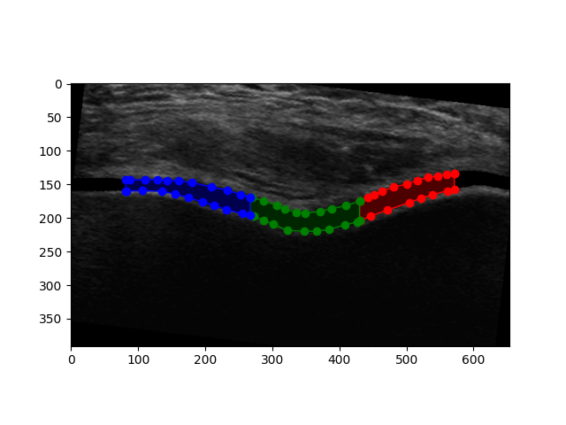

This program streamlines the analysis of femoral trochlear cartilage ultrasound images annotated using ImageJ/Fiji. A directory containing .tiff files can be supplied, with a region of interest being highlighted using ImageJ's polygon tool.        

Common measurements can then be taken from these images, including thickness, cross sectional area, and echo intensity, which are then automatically saved to a CSV file.

The script splits the region of interest as shown, with the medial, intercondyl, and lateral region shown in blue, green and red respectively. 



If you are new to python or git, detailed instructions can be founds in 


# Usage
## Cloning the repo 
```bash
$ git clone https://github.com/JTPiingtoh/FTC-analysis.git
$ cd FTC-analysis
$ python -m venv .venv
$ .venv/scripts/activate
(.venv) $ pip install -r "requirements.txt"
```
## Running the program
```
(.venv) $ python main.py 
```
This will open your machine's file explorer. Select the folder containing your annotated .tiff images.

---

## Example file set-up before running script

```
Parent Directory/
└── Experiment_01/
    ├── image_001.tif
    ├── image_002.tif
    ├── image_003.tif
    . . . 
```


- Only .tif or .tiff files will be analysed

---

## Resulting file set-up after running ```python main.py``` and selecting Experiment_01/


```
Parent Directory/
├── Experiment_01/
│   ├── image_001.tif
│   ├── image_002.tif
│   ├── image_003.tif
│   ...   
│
└── Experiment_01 OUTPUTS - <2025-02-07 14-32-18>/
    ├── analysis_log.log
    ├── Experiment_01 ANALYSED.csv
    │
    └── Experiment_01 ANALYSED IMAGES/
        ├── image_001 ANALYSED.png
        ├── image_002 ANALYSED.png
        └── image_003 ANALYSED.png
```

---

## What Changed

| Component | Purpose |
|------------|----------|
| `OUTPUTS - timestamp/` | Top-level results container |
| `analysis_log.log` | Processing log (errors, images reccommended for review, skipped files) |
| `ANALYSED.csv` | Aggregated FTC results |
| `ANALYSED IMAGES/` | PNG exports with overlays/analysis |

